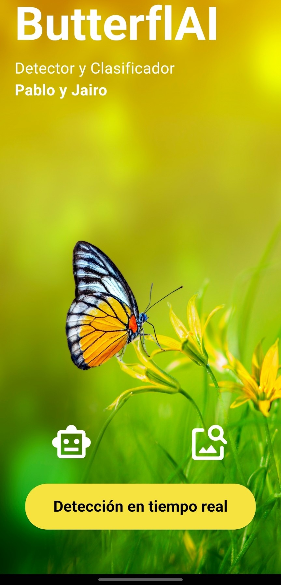
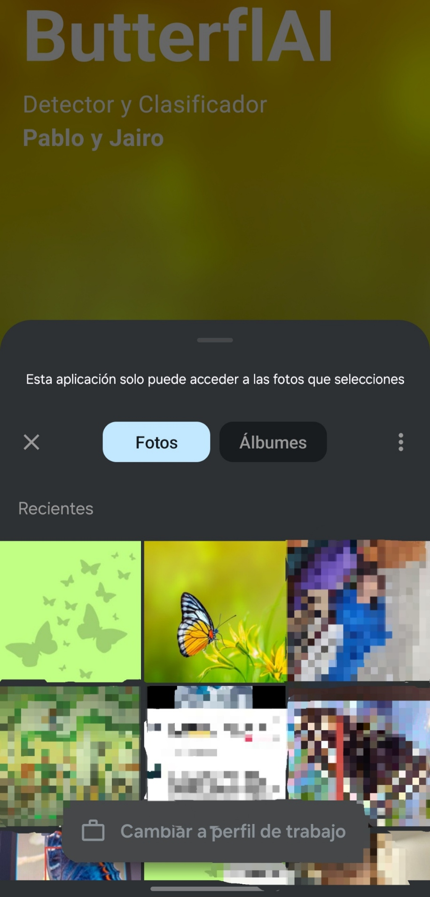
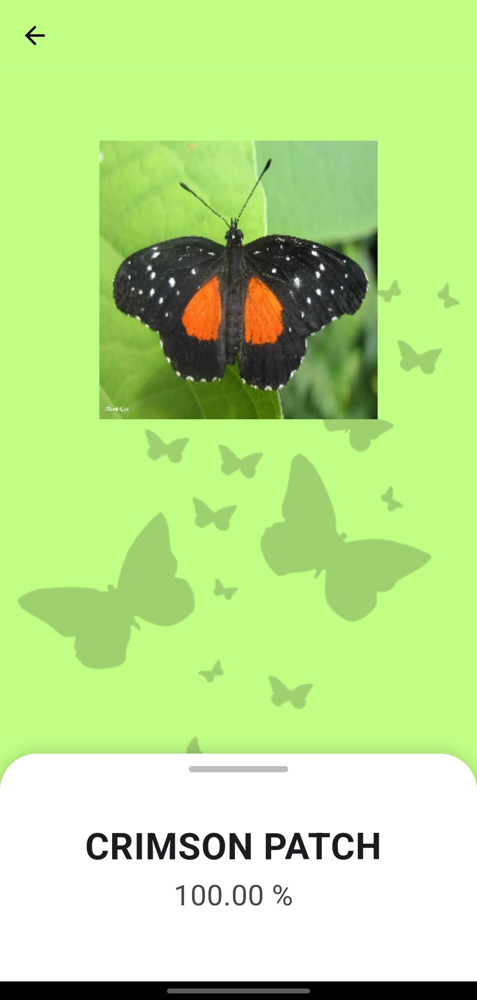
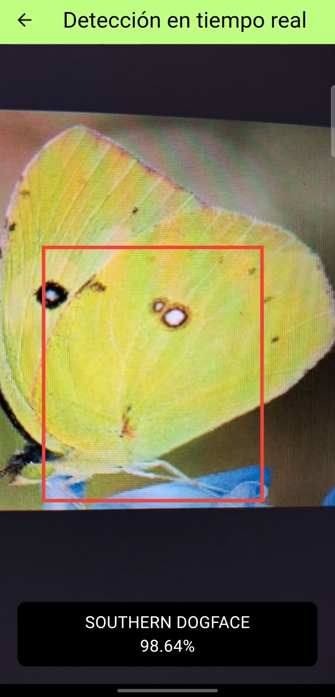

Logo de la app

# ButterflAI
TFM realizado por [Pablo García Muñoz]() y [Jairo Andrades Bueno]() en el **Master de Inteligencía Artificial y Big Data CPIFP Alan Turing**.

## Justificación del proyecto

Nostros dos siempre hemos querido hacer una aplicación de detección con uso a tiempo real para el TFM, inicialmente se nos ocurrio la idea de hacerlo sobre constelaciones ya que el resultado final podría quedar muy bien visualmente pero despues de probrar vimos que no era el enfoque perfecto para un TFM de este master, por ello seguimos con la idea de detección pero esta vez con **Mariposas** y así creamos **BUTTERFLAI** ya que es algo muy visual y comodo el poder usar una aplicación que ha tiempo real sea capaz de detectar la mariposa y te la classifique para decirte que tipo es.

## Índice

1. Descripción del proyecto
2. Obtención de datos
3. Limpieza de datos

    3.1 Comprobación de los datos

    3.2 Eliminación de nulos

    3.3 Carga de imágenes

    3.4 Creación de diccionario de labels
    
    3.5 Descripción de los datos

4. Exploración y visualización de los datos
5. Preparación de los datos para los algoritmos de *Machine Learning*
6. Entrenamiento del modelo y comprobación del rendimiento
7. Uso de *NPL*
8. Web y Aplicación
9. Conclusiones

## 1. Descripción del proyecto

**ButterlfAI** es una aplicación de detección y clasificación de mariposas a tiempo real con la capacidad de detectar hasta 100 clases de mariposas distintas, la hemos desarrollado en dos vertiente una en pagina web y otra para dispositivos moviles. Las dos hacen uso de un chatbot especializado en mariposas para en el caso de tener alguna duda poder preguntarle.

* Para el diseño tanto de la aplicación movil como de la página web hemos usado figma: [Figma Web](https://www.figma.com/design/ppYnvwKn1cuR7QMSj7lIhE/Untitled?node-id=0-1&t=sqGsiv9wRIYfBdJS-1), [Figma App](https://www.figma.com/design/yZJnqPjqBbwB1zLa1cWf5o/ButterflAI_App?t=sqGsiv9wRIYfBdJS-1)

Estas son las tecnologías que hemos usado para desarrollar este proyecto:


### Diagrama del proyecto


Explicación detallada desde abajo hasta arriba:

* **Datos:**
    
    Los datos han sido recogidos desde kaggle ya que había varios dataset con un gran cantidad de fotos que es lo que necesitamos para los dos modelos.
    Estos tres dataset los juntamos en uno sumando las clases ya existente ya añadiendo las nuevas para poder subir el dataset bruto a S3 de AWS.

* **ButterflAI Modelo:**

    Para este TFM hemos usado dos modelos uno es de clasificación que está entrenado desde cero y otro de detección que ha sido creado haciendo *fine-tunning* al modelo de YOLOv8.

    * Clasificación: este modelo lo hemos hecho desde cero usando **TensorFlow** ya que lo usariamos en movil por lo que nos iba a hacer falta convertirlo a **.tflite** para que así este optimizado para moviles.

    * Detección: este modelo ha sido creado desde el modelo de YOLO v8 al cual le hemos hecho **fine-tunning** y así poder detectar las mariposas en las imagenes. YOLO está creado en **Pytorch** por lo que mas adelante está explicado que hemos hecho para usarlo en las dos aplicaciones.

* **Página web:**

    Para hacer uso de los dos modelos creamos una API en **HuggingFace Spaces** con un **Docker** y **FastAPI**, en esta API hay dos endpoints, una para cada modelo.
    La página web está hosteada en **Netlifly**.

* **Aplicación movil:**

    Usa los dos modelos exportados a **.tflite** para así poder optimizar la aplicación ya que usa la camara a tiempo real y no hubiese sido posible conseguir un buen resultado usando una API. La aplicación esta desarrollada en **Flutter**.

* **ChatBot:**

    Las dos aplicaciones tienen **ChatBot** el cual usa la API de **ChatGPT**.

## 2. Obtención de datos

Principalmente buscamos varios dataset que tuviesen lo mismo en comun que son fotos de mariposas, ya que pare el entrenamiento del detector solo necesitamos fotos de mariposas y fotos aleatorios (mas adelante explicamos esto) mientras que para el clasificador necesitamos fotos de mariposas en categorias.

* [butterfly-images40-species](https://www.kaggle.com/datasets/gpiosenka/butterfly-images40-species): Primer dataset utilizado principalmente ya que las imagenes estan clasificadas en carpetas (nombre en ingles) por cada tipo, en total hay 100 tipos entre ellos "MONARCH", "ADONIS", "APPOLLO", etc.

* [butterfly-dataset](https://www.kaggle.com/datasets/veeralakrishna/butterfly-dataset): Segundo dataset utilizado para tener descripciones de las espcies pero de poco nos sirvio ya que solo tenia 10 tipos de mariposas.

* [butterfly-image-classification](https://www.kaggle.com/datasets/phucthaiv02/butterfly-image-classification): Tercer dataset que es como el primero ya que tiene unas 75 clases de mariposas y vienen catalogadas por tipo en un csv.

* [random-images](https://www.kaggle.com/datasets/ezzzio/random-images): Ultimo dataset utilizado para el detector de imagenes ya que haciendo el fine-tunning unicamente con imagenes de mariposas no era muy preciso, pero gracias a añadir imagenes sin mariposas (mas adelante explicado) fue capaz de mejorar la detección.

Para tener una copia de los dataset en la nube por si se nos pierde y ademas de que no nos ocupe mucho espacio en los equipos usamos dos cuadernos **jupyter** para poder subir los dataset a AWS S3 usando las cuentas de *g.educaand*: 
* [Cuaderno de subida](cuadernos/up_awsS3.ipynb)
* [Cuaderno de descarga](cuadernos/down_awsS3.ipynb)

## 3. Limpieza de datos

Para la limpieza de los datos de los datasets hemos divido el proceso en varias partes para que todo sea mas claro y sencillo de explicar y entender ademas de que estan hechos en cuadernos *jupyter*:

### 3.1 Comprobación de los datos

* Nos centramos en el dataset de **butterfly-images40-species** ya que es el que mas imagenes y especies tiene:
```
# Muestra la cantidad de datos para train, valid y test
df['data set'].value_counts()
-------------------------------------------------------
data set
train    12594
test       500
valid      500
Name: count, dtype: int64
```
* Cantidad de datos por cada tipo de mariposa que hay en el conjunto de entrenamiento:
```
df[df['data set'] == 'train']['labels'].value_counts()
--------------------------------------------------------
labels
MOURNING CLOAK         187
GREEN HAIRSTREAK       176
BROWN ARGUS            169
BROOKES BIRDWING       165
SLEEPY ORANGE          152
                      ... 
GOLD BANDED            104
CRIMSON PATCH          103
MALACHITE              103
WOOD SATYR             102
SIXSPOT BURNET MOTH    100
Name: count, Length: 100, dtype: int64
```
Vemos que el mínimo de imágenes es de **100** mientras que el máximo es **187**.

Ahora, sacamos el mínimo y el máximo número de imágenes por especie de los conjuntos de validación y de prueba:
```
df[df['data set'] == 'test']['labels'].value_counts().min(), df[df['data set'] == 'test']['labels'].value_counts().max()
--------------------------------------------------------
(5, 5)
```
```
df[df['data set'] == 'valid']['labels'].value_counts().min(), df[df['data set'] == 'valid']['labels'].value_counts().max()
--------------------------------------------------------
(5, 5)
```
Con esto confirmamos que hay 5 imágenes por cada especie tanto en el conjunto de validación como en el de prueba.

### 3.2 Eliminación de los nulos

* En general las imagenes al estar en datasets de Kaggle suelen venir bien formateadas y no suelen ser nulas pero aun así hicimos esta función para comprobar los valores:

```
def verificar_imagenes(directorio):
    """
    Verifica que las imágenes en un directorio sean válidas.
    
    Parámetros:
        directorio (str): Ruta del directorio donde están las imágenes.
        
    Retorna:
        imágenes_corruptas (list): Lista con las rutas de las imágenes corruptas o no válidas.
    """
    imagenes_corruptas = []
    formatos_validos = {".jpg", ".jpeg", ".png", ".bmp", ".tiff"}

    for archivo in tqdm(os.listdir(directorio), desc="Verificando imágenes"):
        ruta_imagen = os.path.join(directorio, archivo)

        # Verificar que sea un archivo de imagen válido por extensión
        if not any(archivo.lower().endswith(ext) for ext in formatos_validos):
            print(f"Archivo no válido (extensión incorrecta): {ruta_imagen}")
            imagenes_corruptas.append(ruta_imagen)
            continue

        # Intentar abrir la imagen con OpenCV
        try:
            imagen = cv2.imread(ruta_imagen)
            if imagen is None or imagen.size == 0:
                print(f"Imagen corrupta o vacía: {ruta_imagen}")
                imagenes_corruptas.append(ruta_imagen)
        except Exception as e:
            print(f"Error al leer la imagen {ruta_imagen}: {e}")
            imagenes_corruptas.append(ruta_imagen)

    print(f"Total de imágenes corruptas/no válidas encontradas: {len(imagenes_corruptas)}")
    return imagenes_corruptas

# Uso del código
directorio_imagenes = "ruta/a/tu/dataset"
imagenes_invalidas = verificar_imagenes(directorio_imagenes)

# para eliminar las imagenes corruptas
if imagenes_invalidas:
    for img in imagenes_invalidas:
        os.remove(img)
        print(f"Eliminada imagen corrupta: {img}")

print("Verificación completada.")
```
### 3.3 Carga de imágenes
* Creamos una nueva columna `image` en el dataset para guardar todas las imágenes como un array y las normalizamos entre 0 y 1, con un size **(224, 224)**.
```
df['image'] = df['filepaths'].apply(lambda x: img_to_array(load_img(f"../{x}", target_size=(224, 224))) / 255)
```
* Vemos 5 imágenes de prueba
```
df_sample = df[['image', 'labels']].sample(5)
plt.figure(figsize=(15, 15))
for i in range(5):
    plt.subplot(1, 5, i+1)
    plt.imshow(df_sample.iloc[i, 0])
    plt.title(df_sample.iloc[i, 1])
    plt.axis('off')
plt.show()
```


* Mostramos las 5 primeras filas
```
df.head()
```
| class id | filepaths| labels | data set | image |
|----------|--------------------------|--------|----------|--------|
| 0        | train/ADONIS/001.jpg     | ADONIS | train    | [[[0.0, 0.023529412, 0.019607844], [0.0, 0.050... |
| 0        | train/ADONIS/002.jpg     | ADONIS | train    | [[[0.33333334, 0.29803923, 0.12941177], [0.313... |
| 0        | train/ADONIS/003.jpg     | ADONIS | train    | [[[0.50980395, 0.48235294, 0.3019608], [0.5098... |
| 0        | train/ADONIS/004.jpg     | ADONIS | train    | [[[0.54509807, 0.5254902, 0.29803923], [0.5450... |
| 0        | train/ADONIS/005.jpg     | ADONIS | train    | [[[0.61960787, 0.654902, 0.2901961], [0.619607... |

### 3.4 Creación de diccionario de labels
* Como podemos ver, tenemos una columna `class id` y otra `labels`. Para eliminar esta última, creamos un diccionario que sea `{id: label}` que nos permite obtener el nombre meditante el número de la clase. 
```
dict_name = dict(zip( df['class id'], df['labels']))
dict_name
--------------------------------------------------------
{0: 'ADONIS',
 1: 'AFRICAN GIANT SWALLOWTAIL',
 2: 'AMERICAN SNOOT',
 3: 'AN 88',
 4: 'APPOLLO',
 ...
 95: 'VICEROY',
 96: 'WHITE LINED SPHINX MOTH',
 97: 'WOOD SATYR',
 98: 'YELLOW SWALLOW TAIL',
 99: 'ZEBRA LONG WING'}
```

### 3.5 Descripción de los datos

* Como hemos comentado antes los datos importantes de los datasets son las imágenes pero para el caso del entrenamiento del modelo de **detección** necesitabamos los datos en formato **YOLO** que son las imagenes con las *labels* (etiquetas con la información de cada imagen como las cordenadas de la caja que delimita la mariposa). Por eso usamos **Roboflow** ya que no era eficiente hacer a mas de 1000 imagenes la caja delimitadora a mano y esta página con el plan gratuito nos permitio a 1000 imagenes y usando el modelo de deteccion de **Dino** poder crear un dataset con el formato **YOLO** que es el que necesitabamos.
    * [Link a nuestro dataset subido a **Roboflow**](https://universe.roboflow.com/butterflai/butterflies-detection-sfxwl/dataset/5)

Ejemplo de un label creado por **Dino**:

Cada label tien estos 5 datos: **0** se refiere a la clase que es, en este caso como todas son mariposas le pone clase **0**, los cuatro siguientes valores son los puntos de *xmin, xmax, ymin, ymax* que sirven para saber donde esta la caja delimitadora de la detección.

```0 0.5 0.48671875 0.92890625 0.9015625```


* Tambien para el modelo de deteccion necesitabamos unas 200 imagenes de objetos aleatorios para que el modelo supiera diferencia entre lo que es una mariposa y no, estos datos tambien son imagenes solo que no tienen un label que les corresponda ya que estas fotos no tiene una mariposa por lo que no tiene una caja delimitadora para la mariposa.


## 4. Exploración y visualización de los datos

## 5. Preparación de los datos para los algoritmos de *Machine Learning*

### 5.1 Modelo de Detección

### 5.2 Modelo de Clasificación

Anteriormente, dejamos el dataset con todas las columnas, además de una nueva llamada `image`. Sin embargo, ya no nos hacen falta la mayoría de ellas.

Contamos con `class id`, `filepaths`, `labels`, `data set` e `image`. De estas, nos quedaremos con `class id` e `image`.

La ruta del archivo ya no es necesaria, porque contamos con la propia imagen, y el label de la clase lo tenemos recogido en un diccionario `{id: label}`, por lo que `filepaths` y `labels` ya no nos sirven.

Por otro lado, queda `data set`, que nos indica para qué conjunto está destinada cada imagen. Por ello, vamos a separar el dataset en los tres grupos:
* Train
* Valid
* Test

Para agilizar el proceso, únicamente cogemos las dos columnas mencionadas (class id e image), desaciéndonos así de las demás:
```
train_df = df[df['data set'] == 'train'][['class id', 'image']]
```
```
valid_df = df[df['data set'] == 'valid'][['class id', 'image']]
```
```
test_df = df[df['data set'] == 'test'][['class id', 'image']]
```

Antes de mostrar el contenido de cada conjunto, vamos a hacer una pequeña modificación en ellos. Primero, se va a hacer un `sample(1)`, para poder mezclarlo entero. Después, reseteamos los índices, pues al partirlos se han quedado con el que tenían en el dataset original.

```
train_df = train_df.sample(frac=1).reset_index(drop=True)
```
```
valid_df = valid_df.sample(frac=1).reset_index(drop=True)
```
```
test_df = test_df.sample(frac=1).reset_index(drop=True)
```

Ahora, visualizamos el contenido y verificamos que tenga la estructura que buscamos.
```
train_df
```
| class id | image |
|----------|--------|
|26|[[[0.3372549, 0.27450982, 0.14117648], [0.3294...|
|81|[[[0.8156863, 0.54901963, 0.29411766], [0.8470...|
|4|[[[0.16470589, 0.15686275, 0.105882354], [0.16...|

Pasamos a separar cada grupo en dos. En primer lugar, el conjunto `X`, con el **array de cada imagen** y, en segundo lugar, el conjunto `y`, que contendrá los **índices de cada clase**.

```
X_train, y_train = train_df['image'], train_df['class id']
```
```
X_valid, y_valid = valid_df['image'], valid_df['class id']
```
```
X_test, y_test = test_df['image'], test_df['class id']
```

Ya tenemos los conjuntos `y` con los índices, pero necesitamos que estén en one-hot para poder ver la importancia que se le ha dado a cada clase.
```
# Saca el número de clases
num_classes = y_train.nunique()
# Convierte en one-hot
y_train = tf.keras.utils.to_categorical(y_train, num_classes=num_classes)
```
```
y_valid = tf.keras.utils.to_categorical(y_valid, num_classes=num_classes)
```
```
y_test = tf.keras.utils.to_categorical(y_test, num_classes=num_classes)
```
De esta forma, pasarán a tener la siguiente estructura:
```
y_train
--------------------------------------------------------
array([[0., 0., 0., ..., 0., 0., 0.],
       [0., 0., 0., ..., 0., 0., 0.],
       [0., 0., 0., ..., 0., 0., 0.],
       ...,
       [0., 0., 0., ..., 0., 0., 0.],
       [0., 0., 0., ..., 0., 0., 0.],
       [0., 0., 0., ..., 0., 0., 0.]], dtype=float32)
```

Sacamos el tipo de cada conjunto, para verificar que sean del tipo esperado.
```
X_train.dtype, y_train.dtype, X_valid.dtype, y_valid.dtype, X_test.dtype, y_test.dtype
--------------------------------------------------------
(dtype('O'),
 dtype('float32'),
 dtype('O'),
 dtype('float32'),
 dtype('O'),
 dtype('float32'))
```
No obstante, los conjuntos `X` aparecen de tipo *O*. Por ello, realizamos la conversión para que sean *float32* igual que los `y`.
```
X_train = np.array(X_train.tolist())
X_valid = np.array(X_valid.tolist())
X_test = np.array(X_test.tolist())
```
Si volvemos a visualizar los tipos, aparecerán todos como *float32*, por lo que ya tenemos los datos listos para el modelo.
```
X_train.dtype, y_train.dtype, X_valid.dtype, y_valid.dtype, X_test.dtype, y_test.dtype
--------------------------------------------------------
(dtype('float32'),
 dtype('float32'),
 dtype('float32'),
 dtype('float32'),
 dtype('float32'),
 dtype('float32'))
```

## 6. Entrenamiento del modelo y comprobación del rendimiento

### 6.1 Modelo de Detección

### 6.2 Modelo de Clasificación

<h4 style="text-decoration: underline;">Estructura del modelo</h4>

Para explicar el modelo que hemos creado, vamos a verlo por partes.

1. **Tamaño de entrada**: especificamos las dimensiones del array de entrada, es decir, de una foto de **224x224 a color**.
```
Input((224, 224, 3)),
```
2. **Capa de entrada**: definimos la primera capa convolucional con **64 filtros de (3x3)** que usará la función de **activación relu** y una **regularización L2** aplicada a los pesos de la capa para prevenir sobreajuste.
Después, pasará por una capa para **normalizar** la salida y, por último, por una capa de **pooling** (2x2).
```
Conv2D(64, (3, 3), activation='relu', kernel_regularizer=regularizers.l2(0.00005)),
BatchNormalization(),
MaxPooling2D(2, 2),
```
3. **Capas ocultas**: en total encontramos cinco capas ocultas, con diferente número de filtros que variarán entre 128 y 512. A partir de la segunda capa, encontramos un **dropout** después del **pooling**, con un valor distinto en cada una, para evitar el sobreajuste del modelo.
```
Conv2D(256, (3, 3), activation='relu', kernel_regularizer=regularizers.l2(0.00005)),
BatchNormalization(),
MaxPooling2D(2, 2),
Dropout(0.2),
```
4. **Capa de salida**: la última capa nos daría el resultado del modelo, es decir, la confianza que se le ha dado a cada una de las 100 clases, para ello usa la función softmax.
```
Dense(100, activation='softmax')
``` 
Por tanto, el modelo en su totalidad se vería de la siguiente manera:
```
model = keras.Sequential([
    # Tamaño de entrada
    Input((224, 224, 3)),
    # Primera capa convolucional
    Conv2D(64, (3, 3), activation='relu', kernel_regularizer=regularizers.l2(0.00005)),
    BatchNormalization(),
    MaxPooling2D(2, 2),
    
    # Segunda capa convolucional
    Conv2D(128, (3, 3), activation='relu', kernel_regularizer=regularizers.l2(0.00005)),
    BatchNormalization(),
    MaxPooling2D(2, 2),
    
    # Tercera capa convolucional
    Conv2D(256, (3, 3), activation='relu', kernel_regularizer=regularizers.l2(0.00005)),
    BatchNormalization(),
    MaxPooling2D(2, 2),
    Dropout(0.2),
    
    # Cuarta capa convolucional
    Conv2D(512, (3, 3), activation='relu', kernel_regularizer=regularizers.l2(0.00005)),
    BatchNormalization(),
    MaxPooling2D(2, 2),
    Dropout(0.3),
    
    # Quinta capa convolucional
    Flatten(),
    Dense(512, activation='relu', kernel_regularizer=regularizers.l2(0.00005)),
    BatchNormalization(),
    Dropout(0.4),
    
    # Sexta capa convolucional
    Dense(256, activation='relu', kernel_regularizer=regularizers.l2(0.00005)),
    BatchNormalization(),
    Dropout(0.3),
    
    # Capa de salida
    Dense(100, activation='softmax')
])
```
**Compilamos** el modelo usando el **optimizador** *Adam* con un **lr de 0.001**, la **función de pérdida** **categorical_crossentropy** y la **precisión** como **métrica**.
```
model.compile(
    optimizer=keras.optimizers.Adam(learning_rate=0.001), 
    loss='categorical_crossentropy',
    metrics=['accuracy']
)
```

Antes de entrenar el modelo, aplicamos **Data Augmentation** para intentar mejorar la generalización de las imágenes.
```
datagen = ImageDataGenerator(
    rotation_range=30, # Rotación aleatoria en el rango de 30 grados
    width_shift_range=0.2, # Traslación horizontal aleatoria
    height_shift_range=0.2, # Traslación vertical aleatoria
    shear_range=0.2, # Cizallamiento aleatorio (transformación de corte)
    zoom_range=0.2, # Zoom aleatorio in o out de 20%
    horizontal_flip=True,  # Volteo horizontal aleatorio
    fill_mode='nearest', # Rellena los píxeles que faltan con los valores más cercanos
)
```
Ajusta el generador a los datos de entrenamiento.
```
datagen.fit(X_train)
```
<h4 style="text-decoration: underline;">Entrenamiento del modelo</h4>

Para hacer un entrenamiento más eficiente, aplicamos los siguientes callbacks:

1. **Early stopping**: observa el **val_loss** para deterner el modelo si no mejora durante **7 épocas**, quedándose con los mejores pesos.
```
early_stopping = EarlyStopping(
    monitor='val_loss',
    patience=7,
    restore_best_weights=True
)
```
2. **Reduce LR**: observa el **val_loss** para **reducir** la tasa de aprendizaje **a la mitad** si no mejora durante **3 épocas**, con un **límite mínimo de 1e-6**.
```
reduce_lr = ReduceLROnPlateau(
    monitor='val_loss',
    factor=0.5,
    patience=3,
    min_lr=1e-6
)
```

Ahora sí, entrenamos el modelo. Para ello, usamos el **datagen** con los datos de entrenamiento y un **batch_size de 64**. Además, especificamos que dure **100 épocas**, que use un **batch_size de 64**, agregamos los **datos de validación** y, para finalizar, los **callbacks**. Vamos a guardar el entrenamiento en la variable `history` para más adelante visualizarlo en un gráfico.
```
history = model.fit(
    datagen.flow(X_train, y_train, batch_size=64),
    epochs=100, 
    batch_size=64,
    validation_data=(X_valid, y_valid),
    callbacks=[early_stopping, reduce_lr]
)
```
El entrenamiento ha finalizado en la época 82, con una precisión en los datos de entrenamiento y validación de 0.9621 y 0.9420, respectivamente.

Si visualizamos las gráficas de **precisión** y de **pérdida** mediante la variable `history` podemos ver que la **evolución** de las dos líneas es muy **parecida** en ambos casos, manteniéndose muy cercanas en todo momento.


<h4 style="text-decoration: underline;">Prueba del modelo</h4>

Hacemos una **evaluación** del modelo con los datos de **prueba** y obtenemos una **precisión** de **0.9620**.
```
test_loss, test_acc = model.evaluate(X_test, y_test)
--------------------------------------------------------
16/16 [==============================] - 1s 36ms/step - loss: 0.6589 - accuracy: 0.9620
```

Sacamos las clases **reales** y las **predichas** y mostramos los resultados en una **matriz de confusión**.
```
# Saca la precisión en los datos de prueba
predictions = model.predict(X_test)
# Saca las clases predichas y las verdaderas
predicted_classes = np.argmax(predictions, axis=1)
true_classes = np.argmax(y_test, axis=1) 
```


Como se puede apreciar, casi todos los **valores** se encuentran en la **diagonal de la matriz**, indicando que se han acertado casi todas las fotos.

Realizamos un recuento y obtenemos un total de **481 aciertos** frente a **19 fallos**, es decir, un **3.8%** de las imágenes.
```
correct = np.sum(predicted_classes == true_classes)
incorrect = len(true_classes) - correct
correct, incorrect
--------------------------------------------------------
(481, 19)
```

Por último, vemos los **aciertos** que se han conseguido por **cada clase**. Si nos fijamos en el **gráfico de barras**, solo hay una clase que haya obtenido dos fallos (el resto uno), por lo que en total **habrían fallado 18 clases de 100**.


El modelo muestra un **rendimiento excelente** en la clasificación de imágenes de mariposas, con una **precisión global de 0.96**, habiendo obtenido una precisión, recall y f1-score de 1.0 en la mayoría de los casos.
```
# Genera un informe de clasificación
report = classification_report(true_classes, predicted_classes, target_names=[dict_name[i] for i in range(100)])
print(report)
```
| Especie                        | Precisión | Recall | F1-Score | Soporte |
|--------------------------------|-----------|--------|----------|---------|
| ADONIS                         | 0.83      | 1.00   | 0.91     | 5       |
| AFRICAN GIANT SWALLOWTAIL      | 1.00      | 1.00   | 1.00     | 5       |
| AMERICAN SNOOT                 | 0.80      | 0.80   | 0.80     | 5       |
| AN 88                          | 1.00      | 1.00   | 1.00     | 5       |
| APPOLLO                        | 1.00      | 1.00   | 1.00     | 5       |
| ...                            | ...       | ...    | ...      | ...     |
| **accuracy**            |   |        |  **0.96**        | 500     |
| **macro avg**             | **0.97**  | **0.96** | **0.96** | 500   |
| **weighted avg**         | **0.97**  | **0.96** | **0.96** | 500   |


## 7. Uso de *NPL*
## 8. Web y Aplicación

### Página Web

### Aplicación Móvil

A parte de la página web, contamos con una aplicación desarrollada en **Flutter** 
para dispositivos Android.

<h4 style="text-decoration: underline;">Interfaz</h4>

Al abrirla, lo primero que veremos será la **pantalla de inicio**. Esta 
nos permitirá **movernos** entre las distintas páginas que comprenden la aplicación.

En la **parte superior**, encontramos el **nombre de la app**, un subtítulo con 
los **modelos que contiene** y **nuestros nombres**. 

En la **parte inferior**, dos **iconos** con los que acceder al **chatbot** y 
la selección de un **archivo a clasificar**, respectivamente. Por último, un 
**botón** para **detectar mariposas en tiempo real**.



Le damos al icono del **robot** para acceder al **chatbot**. Este utiliza el 
modelo *gpt-4o-mini* especializado únicamente en **mariposas y polillas**, para poder preguntar cualquier duda sobre las mismas o aprender datos curiosos en cualquier momento.

En esta pantalla, encontramos un cuadro de texto con el que escribir el **prompt**, que debe ser de una **longitud máxima de 300 caracteres**, aunque no tiene **ningún límite** en cuanto al **uso del mismo**.


Regresamos a la pantalla de inicio, esta vez le damos al icono de la **galería con una lupa** para **seleccionar una foto** de nuestro **dispositivo**. 



Al escogerla, nos redirige a otra pantalla donde se nos **muestra la foto elegida** y un **desplegable** desde la parte inferior, que deja ver de primeras la **especie predicha** con su **confianza** y, si **deslizamos** hacia arriba, las **diez mejores predicciones** en orden según su confianza (mostrándola también).



Por último, accedemos a la **detección en tiempo real** mediante el botón del inicio.
Nos aparecerá la **cámara trasera** con la que deberemos apuntar a la **mariposa**.

Cuando se **detecte** alguna, se mostrará un **cuadro rojo** sobre esta y, en la **caja negrq** en la parte inferior, saldrá la **especie** predicha junto con su **confianza**.



<h4 style="text-decoration: underline;">¿Cómo me descargo la app?</h4>

Para poder utilizar la aplicación, **únicamente** se necesita el **APK** que se encuentra en este mismo repositorio. Puedes acceder y **descargártelo** desde aquí.

-------------------- ENLACE AL APK  --------------------

<h4 style="text-decoration: underline;">¿Es fiable?</h4>

La aplicación no se ha diseñado con **ningún fin malicioso**, sino para **facilitar el uso de los modelos** sin necesidad de acceder a la web, permitiendo el **uso en tiempo real** para evitar sacar las fotografías y **ahorrar** así **tiempo** y **espacio**.

<h4 style="text-decoration: underline;">¿Qué permisos necesita?</h4>

Al abrirla por primera vez se solicitarán los permisos de **cámara** y **micrófono** para usar la detección en tiempo real, además de poder acceder a los archivos de tu móvil en caso de querer seleccionar una foto de la galería.


<h4 style="text-decoration: underline;">¿Qué pasos debo seguir una vez me desargue el APK?</h4>

Depende del dispositivo pueden variar un poco los pasos. 

1. **Ejecutar el APK**: seguramente te pregunten si quieres instalarla, por lo que le damos a ***Instalar***.

2. **Análisis de la app**: al tratarse de un APK desconocido, el móvil posiblemente te **alerte** para que realices un **análisis**. En este caso, **da igual lo que hagas** porque, como hemos dicho antes, la aplicación es **totalmente fiable**, por lo que saldrá **limpio**, indicando que es **segura**.

3. **Instalación**: si ya hemos hecho los dos pasos anteriores, la aplicación se debería estar instalando, así que solo queda esperar a que termine. Una vez acabe, le damos a **Abrir** si nos sale el cuadro emergente, en caso contrario, buscamos el **logotipo** de la aplicación.

-------------------- INSERTAR FOTOS DE LOS PASOS  --------------------

-------------------- INSERTAR FOTO DEL LOGO  --------------------

## 9. Conclusiones