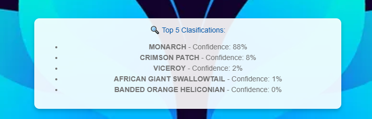
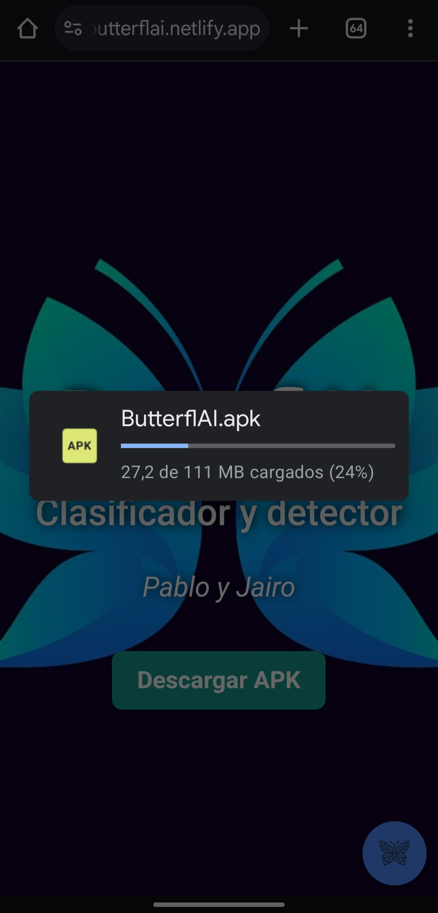

# ButterflAI
TFM realizado por [Pablo García Muñoz](https://github.com/PabloGM1204) y [Jairo Andrades Bueno](https://github.com/jairopo) en el **Máster de Inteligencia Artificial y Big Data CPIFP Alan Turing**.

[Página web](https://butterflai.netlify.app) | [Aplicacion móvil](https://drive.google.com/file/d/1O-liTP4_6jbJLg1SsTMgejRB49yk3DIP/view?usp=drive_link) | [Vídeo](https://www.youtube.com/watch?v=6tQGDaMOLmQ&ab_channel=JairoAndradesBueno) | [Presentación](ButterflAI_pptx.pdf)

# Autores

* [Pablo García Muñoz](https://github.com/PabloGM1204) --> 60 %
* [Jairo Andrades Bueno](https://github.com/jairopo) --> 40 %

## Justificación del proyecto

Nosotros dos siempre hemos querido hacer una aplicación de detección en tiempo real para el TFM, inicialmente se nos ocurrió la idea de hacerlo sobre constelaciones ya que el resultado final podría quedar muy bien visualmente pero después de probar vimos que no era el enfoque perfecto para un TFM de este master, por ello seguimos con la idea de detección pero esta vez con **mariposas** y así creamos **BUTTERFLAI** ya que es algo muy visual y cómodo el poder usar una aplicación que en tiempo real sea capaz de detectar la mariposa y te la clasifique para decirte que tipo es y además, darte información del tipo que ha clasificado.

## Índice

1. [Descripción del proyecto](#1-descripción-del-proyecto)
2. [Obtención de datos](#2-obtención-de-datos)
3. [Limpieza de datos](#3-limpieza-de-datos)

    3.1 [Comprobación de los datos](#31-comprobación-de-los-datos)

    3.2 [Eliminación de los nulos](#32-eliminación-de-los-nulos)

    3.3 [Carga de imágenes](#33-carga-de-imágenes)

    3.4 [Creación de diccionario de labels](#34-creación-de-diccionario-de-labels)
    
    3.5 [Descripción de los datos](#35-descripción-de-los-datos)

    3.6 [Scrapping](#36-scrapping)

4. [Exploración y visualización de los datos](#4-exploración-y-visualización-de-los-datos)
5. [Preparación de los datos para los algoritmos de *Machine Learning*](#5-preparación-de-los-datos-para-los-algoritmos-de-machine-learning)
6. [Entrenamiento del modelo y comprobación del rendimiento](#6-entrenamiento-del-modelo-y-comprobación-del-rendimiento)
7. [Uso de *NLP*](#7-uso-de-nlp)
8. [Web y Aplicación](#8-web-y-aplicación)
9. [Conclusiones](#9-conclusiones)
10. [Bibliografía](#10-bibliografia)

## 1. Descripción del proyecto

**ButterflAI** es una aplicación de detección y clasificación de mariposas a tiempo real con la capacidad de detectar hasta 100 clases de mariposas distintas, la hemos desarrollado en dos vertientes, una en página web y otra para dispositivos móviles. Ambas incluyen un chatbot especializado en mariposas, al cual se le puede hacer preguntas en caso de duda.

* Para el diseño tanto de la aplicación móvil como de la página web hemos usado figma: [Figma Web](https://www.figma.com/design/ppYnvwKn1cuR7QMSj7lIhE/Untitled?node-id=0-1&t=sqGsiv9wRIYfBdJS-1), [Figma App](https://www.figma.com/design/yZJnqPjqBbwB1zLa1cWf5o/ButterflAI_App?t=sqGsiv9wRIYfBdJS-1)

Estas son las tecnologías que hemos usado para desarrollar este proyecto:


### Diagrama del proyecto


Explicación detallada desde abajo hasta arriba:

* **Datos:**
    
    Los datos han sido recopilados desde Kaggle, ya que había varios datasets con una gran cantidad de fotos que es lo que necesitamos para los dos modelos.
    Para obtener información sobre las mariposas, hemos realizado scraping en una web.
    Estos tres dataset los juntamos en uno sumando las clases ya existentes y añadiendo las nuevas para poder subir el dataset bruto a S3 de AWS.

* **ButterflAI Modelo:**

    Para este TFM hemos utilizado dos modelos: uno de clasificación que está entrenado desde cero y otro de detección que ha sido creado haciendo *fine-tuning* al modelo de YOLOv8.

    * Clasificación: Este modelo lo hemos desarrollado desde cero usando **TensorFlow**, ya que lo usaríamos en móvil por lo que nos iba a hacer falta convertirlo a **.tflite** para que así este optimizado para móviles.

    * Detección: Este modelo ha sido creado a partir de YOLOv8, al cual le hemos aplicado **fine-tuning** y así poder detectar las mariposas en las imagenes. YOLO está creado en **Pytorch** por lo que mas adelante está explicado que hemos hecho para usarlo en las dos aplicaciones.

* **Página web:**

    Para hacer uso de los dos modelos creamos una API en **HuggingFace Spaces** con un **Docker** y **FastAPI**, en esta API hay dos *endpoints*, una para cada modelo.
    La página web está alojada en **Netlify**.

* **Aplicación móvil:**

    Utiliza los dos modelos exportados a .tflite para optimizar la aplicación, ya que usa la cámara en tiempo real y no hubiese sido posible conseguir un buen resultado usando una API. La aplicación esta desarrollada en **Flutter**.

* **ChatBot:**

    Ambas aplicaciones incluyen un chatbot que utiliza la API de **ChatGPT** y cuenta con función de *text-to-speech*.

## 2. Obtención de datos

Principalmente buscamos varios datasets que tuviesen en común que fueran fotos de mariposas, ya que para el entrenamiento del detector solo necesitamos fotos de mariposas y fotos aleatorias (más adelante lo explicamos) mientras que para el clasificador necesitamos fotos de mariposas organizadas en categorías.

* [butterfly-images40-species](https://www.kaggle.com/datasets/gpiosenka/butterfly-images40-species): Primer dataset utilizado principalmente, ya que las imágenes están clasificadas en carpetas (nombre en inglés) por cada tipo. En total, hay 100 tipos, entre ellos "MONARCH", "ADONIS", "APPOLLO", etc.

* [butterfly-dataset](https://www.kaggle.com/datasets/veeralakrishna/butterfly-dataset): Segundo dataset utilizado para obtener descripciones de las especies, pero de poco nos sirvió, ya que solo tenía 10 tipos de mariposas.

* [butterfly-image-classification](https://www.kaggle.com/datasets/phucthaiv02/butterfly-image-classification): Tercer dataset, similar al primero, ya que tiene unas 75 clases de mariposas y están catalogadas por tipo en un archivo CSV.

* [random-images](https://www.kaggle.com/datasets/ezzzio/random-images): Último dataset utilizado para el detector de imágenes. Al realizar el fine-tuning únicamente con imágenes de mariposas, la precisión no era óptima, pero al añadir imágenes sin mariposas (explicado más adelante), se logró mejorar la detección.

Para obtener información sobre cada mariposa, hemos realizado scraping de esta web [butterfly-conservation](https://butterfly-conservation.org):

* En está [carpeta](scrapping/) esta todo sobre el scraping.
* Enlace de los archivos en S3 [mariposas.json](https://info-tmf-butterflai.s3.us-east-1.amazonaws.com/datos/mariposas.json), [polillas.json](https://info-tmf-butterflai.s3.us-east-1.amazonaws.com/datos/moths.json).


Para contar con una copia de los datasets en la nube, en caso de pérdida, y para ahorrar espacio en los equipos, utilizamos dos cuadernos **Jupyter** para subirlos a AWS S3 mediante las cuentas de *g.educaand*.
* [Cuaderno para la subida de datos](cuadernos/up_awsS3.ipynb)
* [Cuaderno para la descarga de datos](cuadernos/down_awsS3.ipynb)

## 3. Limpieza de datos

Para la limpieza de los datos de los datasets, hemos dividido el proceso en varias partes para que todo sea más claro y sencillo de explicar y entender, además de que están hechos en cuadernos *Jupyter*:

### 3.1 Comprobación de los datos

* Nos centramos en el dataset de **butterfly-images40-species** ya que es el que mas imagenes y especies tiene:
```
# Muestra la cantidad de datos para train, valid y test
df['data set'].value_counts()
-------------------------------------------------------
data set
train    12594
test       500
valid      500
Name: count, dtype: int64
```
* Cantidad de datos por cada tipo de mariposa que hay en el conjunto de entrenamiento:
```
df[df['data set'] == 'train']['labels'].value_counts()
--------------------------------------------------------
labels
MOURNING CLOAK         187
GREEN HAIRSTREAK       176
BROWN ARGUS            169
BROOKES BIRDWING       165
SLEEPY ORANGE          152
                      ... 
GOLD BANDED            104
CRIMSON PATCH          103
MALACHITE              103
WOOD SATYR             102
SIXSPOT BURNET MOTH    100
Name: count, Length: 100, dtype: int64
```
Vemos que el mínimo de imágenes es de **100** mientras que el máximo es **187**.

Ahora, sacamos el mínimo y el máximo número de imágenes por especie de los conjuntos de validación y de prueba:
```
df[df['data set'] == 'test']['labels'].value_counts().min(), df[df['data set'] == 'test']['labels'].value_counts().max()
--------------------------------------------------------
(5, 5)
```
```
df[df['data set'] == 'valid']['labels'].value_counts().min(), df[df['data set'] == 'valid']['labels'].value_counts().max()
--------------------------------------------------------
(5, 5)
```
Con esto confirmamos que hay 5 imágenes por cada especie tanto en el conjunto de validación como en el de prueba.

### 3.2 Eliminación de los nulos

* En general, las imágenes en los datasets de Kaggle suelen estar bien formateadas y no suelen ser nulas, pero aun así, creamos esta función para comprobar los valores:

```
def verificar_imagenes(directorio):
    """
    Verifica que las imágenes en un directorio sean válidas.
    
    Parámetros:
        directorio (str): Ruta del directorio donde están las imágenes.
        
    Retorna:
        imágenes_corruptas (list): Lista con las rutas de las imágenes corruptas o no válidas.
    """
    imagenes_corruptas = []
    formatos_validos = {".jpg", ".jpeg", ".png", ".bmp", ".tiff"}

    for archivo in tqdm(os.listdir(directorio), desc="Verificando imágenes"):
        ruta_imagen = os.path.join(directorio, archivo)

        # Verificar que sea un archivo de imagen válido por extensión
        if not any(archivo.lower().endswith(ext) for ext in formatos_validos):
            print(f"Archivo no válido (extensión incorrecta): {ruta_imagen}")
            imagenes_corruptas.append(ruta_imagen)
            continue

        # Intentar abrir la imagen con OpenCV
        try:
            imagen = cv2.imread(ruta_imagen)
            if imagen is None or imagen.size == 0:
                print(f"Imagen corrupta o vacía: {ruta_imagen}")
                imagenes_corruptas.append(ruta_imagen)
        except Exception as e:
            print(f"Error al leer la imagen {ruta_imagen}: {e}")
            imagenes_corruptas.append(ruta_imagen)

    print(f"Total de imágenes corruptas/no válidas encontradas: {len(imagenes_corruptas)}")
    return imagenes_corruptas

# Uso del código
directorio_imagenes = "ruta/a/tu/dataset"
imagenes_invalidas = verificar_imagenes(directorio_imagenes)

# para eliminar las imagenes corruptas
if imagenes_invalidas:
    for img in imagenes_invalidas:
        os.remove(img)
        print(f"Eliminada imagen corrupta: {img}")

print("Verificación completada.")
```
### 3.3 Carga de imágenes
* Creamos una nueva columna `image` en el dataset para almacenar todas las imágenes como un array y las normalizamos entre 0 y 1, con un tamaño de **(224, 224)**.
```
df['image'] = df['filepaths'].apply(lambda x: img_to_array(load_img(f"../{x}", target_size=(224, 224))) / 255)
```
* Vemos 5 imágenes de prueba
```
df_sample = df[['image', 'labels']].sample(5)
plt.figure(figsize=(15, 15))
for i in range(5):
    plt.subplot(1, 5, i+1)
    plt.imshow(df_sample.iloc[i, 0])
    plt.title(df_sample.iloc[i, 1])
    plt.axis('off')
plt.show()
```


* Mostramos las 5 primeras filas
```
df.head()
```
| class id | filepaths| labels | data set | image |
|----------|--------------------------|--------|----------|--------|
| 0        | train/ADONIS/001.jpg     | ADONIS | train    | [[[0.0, 0.023529412, 0.019607844], [0.0, 0.050... |
| 0        | train/ADONIS/002.jpg     | ADONIS | train    | [[[0.33333334, 0.29803923, 0.12941177], [0.313... |
| 0        | train/ADONIS/003.jpg     | ADONIS | train    | [[[0.50980395, 0.48235294, 0.3019608], [0.5098... |
| 0        | train/ADONIS/004.jpg     | ADONIS | train    | [[[0.54509807, 0.5254902, 0.29803923], [0.5450... |
| 0        | train/ADONIS/005.jpg     | ADONIS | train    | [[[0.61960787, 0.654902, 0.2901961], [0.619607... |

### 3.4 Creación de diccionario de labels
* Como podemos ver, tenemos una columna `class id` y otra `labels`. Para eliminar esta última, creamos un diccionario que sea `{id: label}` que nos permite obtener el nombre mediante el número de la clase. 
```
dict_name = dict(zip( df['class id'], df['labels']))
dict_name
--------------------------------------------------------
{0: 'ADONIS',
 1: 'AFRICAN GIANT SWALLOWTAIL',
 2: 'AMERICAN SNOOT',
 3: 'AN 88',
 4: 'APPOLLO',
 ...
 95: 'VICEROY',
 96: 'WHITE LINED SPHINX MOTH',
 97: 'WOOD SATYR',
 98: 'YELLOW SWALLOW TAIL',
 99: 'ZEBRA LONG WING'}
```

### 3.5 Descripción de los datos

* El dataset se compone de las siguientes columnas:

    1. **Class id**: **id** que hace referencia a la **clase** de cada especie, por ejemplo, el class id **0** se refiere a **ADONIS**.

    2. **Filepaths**: **ruta** en la que se encuentra la **imagen** original. Están localizadas en subcarpetas organizadas por tipo de **dataset** y por **especie**. En el caso de la primera, está en la carpeta de **entrenamiento**, dentro de **ADONIS** y se llama **001.jpg**.

    3. **Labels**: **etiquetas** que definen la **clase** de cada mariposa, es decir, la **especie** de la misma (*ADONIS*).

    4. **Data set**: **conjunto** al que pertenece cada imagen. Pueden ser de **entrenamiento** (*train*), de **validación** (*valid*) o de **prueba** (*test*).

    5. **Image**: cada **imagen** representada como un **array** de tipo **flotante** **normalizada** en el rango **[0, 1]**

* Como mencionamos anteriormente, los datos más importantes de los datasets son las imágenes, pero para el entrenamiento del modelo de **detección** necesitábamos los datos en formato **YOLO** que son las imagenes con las *labels* (etiquetas con la información de cada imagen, como las coordenadas de la caja que delimita la mariposa). Por eso usamos **Roboflow** ya que no era eficiente hacer a mas de 1000 imagenes la caja delimitadora a mano y esta página con el plan gratuito nos permitio a 1000 imagenes y usando el modelo de deteccion de **Dino** poder crear un dataset con el formato **YOLO** que es el que necesitabamos.
    * [Link a nuestro dataset subido a **Roboflow**](https://universe.roboflow.com/butterflai/butterflies-detection-sfxwl/dataset/5)

Ejemplo de un label creado por **Dino**:

* Cada label tien estos 5 datos: **0** se refiere a la clase que es, en este caso como todas son mariposas le pone clase **0**, los cuatro siguientes valores son los puntos de *xmin, xmax, ymin, ymax* que sirven para saber donde esta la caja delimitadora de la detección.

```0 0.5 0.48671875 0.92890625 0.9015625```


* Tambien para el modelo de deteccion necesitabamos unas 200 imagenes de objetos aleatorios para que el modelo supiera diferenciar entre lo que es una mariposa y no, estos datos tambien son imagenes solo que no tienen un label que les corresponda ya que estas fotos no tiene una mariposa por lo que no tiene una caja delimitadora para la mariposa.


### 3.6 Scrapping

Hemos hecho **scraping** para poder obtener información de las mariposas y polillas de esta página web [butterfly-conservation](https://butterfly-conservation.org).
Esta página tiene muchos tipos de mariposas y polillas en total unas 300 pero aun así no estan todas las que nostros tenemos pero para aquellas que no estan se las pedimos a la api de chatGPT. Para hacer el scrapeo de tanto las mariposas como de las polillas hacemos todo de la misma manera solo vamos a explicar la de las mariposas.

Para conseguir las urls de cada mariposa lo primero de todo hacemos un scrapeo general a la web donde estan todas las mariposas:

* [mariposas.json](scrapping/butterfly_url.py).
* [polillas.json](scrapping/urls_moths.json).


* Lo primero de todo es configurar el **BeautifulSoup** que es con lo que haremos el scraping:
```
def get_soup(url):
    response = requests.get(url, headers={"User-Agent": "Mozilla/5.0"})
    if response.status_code == 200:
        return BeautifulSoup(response.content, 'html.parser')
    else:
        print(f"Error al acceder a {url} - Código: {response.status_code}")
        return None
```
* Con esta función conseguimos todos las url:
```
def get_all_butterfly_links():
    butterfly_links = []
    page = 0  # Primera página

    while True:
        print(f"Scrapeando página {page + 1}...")
        soup = get_soup(f"{IDENTIFY_URL}?page={page}")
        
        if not soup:
            break  # Si no hay respuesta, terminamos el scraping

        # Buscar enlaces de mariposas dentro de <h3 class="field-content">
        found_links = []
        for h3 in soup.find_all("h3", class_="field-content"):
            link = h3.find("a", href=True)
            if link:
                full_url = BASE_URL + link["href"]  # Convertir ruta relativa en URL completa
                found_links.append(full_url)

        if not found_links:
            break  # Si en la página no hay más enlaces, hemos terminado

        butterfly_links.extend(found_links)
        page += 1  # Pasamos a la siguiente página

    return list(set(butterfly_links))  # Eliminar duplicados

# Ejecutar la función y obtener todas las URLs
butterfly_urls = get_all_butterfly_links()
```
* Con esto lo guardamos en un **.json**.
```
with open("urls_mariposas.json", "w", encoding="utf-8") as f:
    json.dump(butterfly_urls, f, ensure_ascii=False, indent=4)
```

* Asi conseguimos los **.json** con las urls de cada mariposa:

    * [mariposas.json](scrapping/urls_mariposas.json).
    * [polillas.json](scrapping/urls_moths.json).

* Ahora que tenemos ya la url vamos con los datos de cada mariposa y lo primero de todo es leer el **.json** de las urls.
```
with open("urls_mariposas.json", "r", encoding="utf-8") as f:
    butterfly_urls = json.load(f)
```

* Con esta función extraemos la información que buscamos, como la **Descripción**, **Hábitat**, etc:
```
def extract_butterfly_info(url):
    soup = get_soup(url)
    if not soup:
        return None

    # Extraer nombre común
    try:
        name = soup.find("h1").text.strip()
    except AttributeError:
        name = "No disponible"

    # Extraer nombre científico
    try:
        scientific_name = soup.find("p", class_="sub-heading").text.strip()
    except AttributeError:
        scientific_name = "No disponible"

    # Extraer descripción desde <meta name="description">
    try:
        description = soup.find("meta", attrs={"name": "description"})["content"].strip()
    except (AttributeError, TypeError):
        description = "No disponible"

    # Función para extraer información de listas (<ul><li>)
    def extract_list_data(header_text):
        try:
            section = soup.find("h4", text=header_text)
            if section:
                items = section.find_next("ul").find_all("li")
                return [item.text.strip() for item in items]
        except AttributeError:
            return []
        return []

    # Extraer información de distintas secciones
    size_and_family = extract_list_data("Size and Family")
    conservation_status = extract_list_data("Conservation Status")
    foodplants = extract_list_data("Caterpillar Foodplants")
    lifecycle = extract_list_data("Lifecycle")
    habitat = extract_list_data("Habitat")

    return {
        "Nombre común": name,
        "Nombre científico": scientific_name,
        "Descripción": description,
        "Tamaño y Familia": size_and_family,
        "Estado de conservación": conservation_status,
        "Plantas alimenticias de orugas": foodplants,
        "Ciclo de vida": lifecycle,
        "Hábitat": habitat,
        "URL": url
    }
```

* Igual que con las URLs, los datos lo guardamos también en un **.json**:
```
with open("mariposas.json", "w", encoding="utf-8") as f:
    json.dump(butterfly_data, f, ensure_ascii=False, indent=4)
```

* Quedarían estos dos **.json** con toda la información obtenida mediante scraping:

    * [mariposas.json](scrapping/mariposas.json)
    * [moths.json](scrapping/moths.json)

## 4. Exploración y visualización de los datos

Realizamos una pequeña **exploración** sobre los datos.

En primer lugar, como se comentó anteriormente, los datos se encuentran **divididos** en los tres conjuntos de **entrenamiento, validación y prueba**. Por ello, vamos a visualizar cuántas imágenes van para cada uno.

Sacamos un **gráfico de pastel** y vemos que la gran **mayoría** de datos están recogidos en el conjunto de **entrenamiento** (**12594**), mientras que **en los otros dos** encontramos **500 imágenes** por cada uno.


Ejemplo de información de una mariposa:

```
{
        "Nombre común": "Green Hairstreak",
        "Nombre científico": "Callophrys rubi",
        "Descripción": "The Green Hairstreak holds its wings closed, except in flight, showing only the green underside with its faint white streak. The extent of this white marking is very variable; it is frequently reduced to a few white dots and may be almost absent. Males and females look similar and are most readily told apart by their behaviour: rival males may be seen in a spiralling flight close to shrubs, while the less conspicuous females are more often encountered while laying eggs.",
        "Tamaño y Familia": [
            "Family: Hairstreaks",
            "Size: Small",
            "Wing Span Range (male to female): 27-34mm"
        ],
        "Estado de conservación": [
            "GB Red List (2022): Least Concern",
            "Butterfly Conservation priority: Medium",
            "European status: Not threatened"
        ],
        "Plantas alimenticias de orugas": [
            "Countries: England, Scotland, Wales and Ireland",
            "Widespread throughout Britain and Ireland, but not a garden visitor and often difficult to spot",
            "Abundance trend: -38% (1976-2019)",
            "Distribution trend: -16% (1977-2019)"
        ],
        "Ciclo de vida": [
            "Countries: England, Scotland, Wales and Ireland",
            "Widespread throughout Britain and Ireland, but not a garden visitor and often difficult to spot",
            "Abundance trend: -38% (1976-2019)",
            "Distribution trend: -16% (1977-2019)"
        ],
        "Hábitat": [
            "Countries: England, Scotland, Wales and Ireland",
            "Widespread throughout Britain and Ireland, but not a garden visitor and often difficult to spot",
            "Abundance trend: -38% (1976-2019)",
            "Distribution trend: -16% (1977-2019)"
        ],
        "URL": "https://butterfly-conservation.org/butterflies/green-hairstreak"
    },
```

Como contamos con **100 especies** distintas, al tener dicha cantidad en los datos de entrenamiento podemos intuir que hay una cantidad distinta de fotos por clase. Por tanto, mostramos un **gráfico de barras** para visualizar cuántas imágenes tiene cada una.


Si no fijamos, la especie que cuenta con **más imágenes** es la *MOURNING CLOAK*, por el contrario, la que cuenta con menos es la **SIXSPOT BURNET MOTH**. 

Este gráfico nos indica indirectamente que no hay ninguna clase sin fotos. Por el contrario, todas tienen al menos 100 imágenes.

## 5. Preparación de los datos para los algoritmos de *Machine Learning*

En esta parte ya que hemos hecho dos modelos vamos a explicar por separado cada modelo para hacerlo más fácil de entender:

### 5.1 Modelo de Detección

Para el modelo de detección como comentamos anteriormente los únicos datos que necesitamos son los labels **.txt** y las fotos **.jpg** además de que todas las imágenes deben tener el mismo tamaño 640x640, para conseguir ese formato usamos [**Roboflow**](https://universe.roboflow.com/butterflai/butterflies-detection-sfxwl/dataset/5) y así conseguimos el formato de YOLO que es el que necesitamos para hacer fine-tuning al modelo de YOLO v8.
Los demás datos que venían inicialmente en el dataset de *butterfly-images40-species* no nos son necesarios para el modelo de detección por lo que los eliminamos.

También para llegar a conseguir un buen resultado y que el modelo de detección no clasifique erróneamente todo como una mariposa tenemos que darle imágenes que no sean de mariposas y por ello no tengan un *label*, para ello cogimos las 200 primeras imagenes del dataset de [random_img](detector/datasets_original/random_img/dataset/). Estas imágenes vienen en distintos tamaños y necesitábamos estandarizarlas todas al mismo tamaño, lo primero de todo:
```
def load_images_from_folder(folder, num_images):
    # Lista para almacenar las imágenes
    images = []
    # Recorrer el directorio y cargar las imágenes
    for filename in os.listdir(folder):
        if len(images) >= num_images:
            break
        img_path = os.path.join(folder, filename)
        if os.path.isfile(img_path):
            img = Image.open(img_path)
            images.append(img)
    return images

def resize_image(image, size):
    # Redimensionar la imagen
    return image.resize(size, Image.LANCZOS)

def save_image(image, path):
    # Guardar la imagen
    image.save(path)

def process_images(input_folder, output_folder, num_images=200, size=(640, 640)):
    # Crear el directorio de salida si no existe
    if not os.path.exists(output_folder):
        os.makedirs(output_folder)
    
    # Cargar las imágenes del directorio de entrada
    images = load_images_from_folder(input_folder, num_images)

    # Procesar las imágenes
    for i, image in enumerate(images):
        resized_image = resize_image(image, size)
        output_path = os.path.join(output_folder, f"resized_image_{i+1}.jpg")
        save_image(resized_image, output_path)
```
Con estas funciones logramos procesar las imagenes y guardarlas y para usar estas funciones usamos este codigo de aqui:
```
# Uso de la función
input_folder = "random_img/dataset/train"
output_folder = "random_img/editados"
process_images(input_folder, output_folder, num_images=200, size=(640, 640))
```
Para así poder guardar las imágenes en la carpeta [random_img](detector/datasets_original/random_img/editados/).

Ya tenemos todas las imágenes que necesitábamos para el entrenamiento, ahora solo hay que unirlas todas bajo las mismas carpetas creando una estructura de carpetas tal que así:
```
dataset/
│── train/
│   ├── images/       # Imágenes de entrenamiento
│   ├── labels/         # Etiquetas en formato YOLO para entrenamiento
│
│── valid/
│   ├── images/       # Imágenes de validación
│   ├── labels/         # Etiquetas en formato YOLO para validación
│
│── data.yaml      # Archivo de configuración del dataset
```
Esta estructura de carpetas es esta [carpeta](detector/dataset_final/). Además de la estructura como se ve en el gráfico también se necesita un **data.yaml** que es el archivo de configuración del dataset para que a la hora de hacer el *fine-tuning* sea capaz de saber donde estas las imagenes y su *label*:
```
path: D:/TFM/Codigo/dataset_final
train: ../train/images
val: ../valid/images
nc: 1
names: ['butterfly']
```
Vemos que son las rutas tanto de las imágenes como de los *labels*, se sabe que una imagen le pertenece un *label* por el nombre ya que tienen el mismo nombre el modelo entiend que le pertenece a esa imagen, tambien estan los siguientes datos:
* ```path: D:/TFM/Codigo/dataset_final``` -> ruta absoluta de donde esta la carpeta del dataset.
* ```train: ../train/images``` -> ubicación de los datos de entrenamiento.
* ```val: ../valid/images``` -> ubicación de los datos de validación.
* ```nc: 1``` -> significa que solo hay una clase en este dataset en nuestro caso es **butterfly**.
* ```names: ['butterfly']``` -> es aqui donde decimos el nombre de las clases, como pusimos que solo habia una pues aqui solo hay un nombre.

Para la división de datos entre entrenamiento y validación hemos seguido el estándar del **20%** de los datos para que sean de validación.

> **En total de este dataset juntando las _200_ imágenes del _random_img_ más las _1000_ que tenemos en formato YOLO v8 de las mariposas, todo estandarizado al mismo tamaño 640x640, conseguimos un dataset de unas _1200_ imágenes con unas _1000_ etiquetas correspondientes a las imágenes que tienen mariposas.**

### 5.2 Modelo de Clasificación

Anteriormente, dejamos el dataset con todas las columnas, además de una nueva llamada `image`. Sin embargo, ya no nos hacen falta la mayoría de ellas.

Contamos con `class id`, `filepaths`, `labels`, `data set` e `image`. De estas, nos quedaremos con `class id` e `image`.

La ruta del archivo ya no es necesaria, porque contamos con la propia imagen, y el label de la clase lo tenemos recogido en un diccionario `{id: label}`, por lo que `filepaths` y `labels` ya no nos sirven.

Por otro lado, queda `data set`, que nos indica para qué conjunto está destinada cada imagen. Por ello, vamos a separar el dataset en los tres grupos:
* Train
* Valid
* Test

Para agilizar el proceso, únicamente cogemos las dos columnas mencionadas (class id e image), desaciéndonos así de las demás:
```
train_df = df[df['data set'] == 'train'][['class id', 'image']]
```
```
valid_df = df[df['data set'] == 'valid'][['class id', 'image']]
```
```
test_df = df[df['data set'] == 'test'][['class id', 'image']]
```

Antes de mostrar el contenido de cada conjunto, vamos a hacer una pequeña modificación en ellos. Primero, se va a hacer un `sample(1)`, para poder mezclarlo entero. Después, reseteamos los índices, pues al partirlos se han quedado con el que tenían en el dataset original.

```
train_df = train_df.sample(frac=1).reset_index(drop=True)
```
```
valid_df = valid_df.sample(frac=1).reset_index(drop=True)
```
```
test_df = test_df.sample(frac=1).reset_index(drop=True)
```

Ahora, visualizamos el contenido y verificamos que tenga la estructura que buscamos.
```
train_df
```
| class id | image |
|----------|--------|
|26|[[[0.3372549, 0.27450982, 0.14117648], [0.3294...|
|81|[[[0.8156863, 0.54901963, 0.29411766], [0.8470...|
|4|[[[0.16470589, 0.15686275, 0.105882354], [0.16...|

Pasamos a separar cada grupo en dos. En primer lugar, el conjunto `X`, con el **array de cada imagen** y, en segundo lugar, el conjunto `y`, que contendrá los **índices de cada clase**.

```
X_train, y_train = train_df['image'], train_df['class id']
```
```
X_valid, y_valid = valid_df['image'], valid_df['class id']
```
```
X_test, y_test = test_df['image'], test_df['class id']
```

Ya tenemos los conjuntos `y` con los índices, pero necesitamos que estén en one-hot para poder ver la importancia que se le ha dado a cada clase.
```
# Saca el número de clases
num_classes = y_train.nunique()
# Convierte en one-hot
y_train = tf.keras.utils.to_categorical(y_train, num_classes=num_classes)
```
```
y_valid = tf.keras.utils.to_categorical(y_valid, num_classes=num_classes)
```
```
y_test = tf.keras.utils.to_categorical(y_test, num_classes=num_classes)
```
De esta forma, pasarán a tener la siguiente estructura:
```
y_train
--------------------------------------------------------
array([[0., 0., 0., ..., 0., 0., 0.],
       [0., 0., 0., ..., 0., 0., 0.],
       [0., 0., 0., ..., 0., 0., 0.],
       ...,
       [0., 0., 0., ..., 0., 0., 0.],
       [0., 0., 0., ..., 0., 0., 0.],
       [0., 0., 0., ..., 0., 0., 0.]], dtype=float32)
```

Sacamos el tipo de cada conjunto, para verificar que sean del tipo esperado.
```
X_train.dtype, y_train.dtype, X_valid.dtype, y_valid.dtype, X_test.dtype, y_test.dtype
--------------------------------------------------------
(dtype('O'),
 dtype('float32'),
 dtype('O'),
 dtype('float32'),
 dtype('O'),
 dtype('float32'))
```
No obstante, los conjuntos `X` aparecen de tipo *O*. Por ello, realizamos la conversión para que sean *float32* igual que los `y`.
```
X_train = np.array(X_train.tolist())
X_valid = np.array(X_valid.tolist())
X_test = np.array(X_test.tolist())
```
Si volvemos a visualizar los tipos, aparecerán todos como *float32*, por lo que ya tenemos los datos listos para el modelo.
```
X_train.dtype, y_train.dtype, X_valid.dtype, y_valid.dtype, X_test.dtype, y_test.dtype
--------------------------------------------------------
(dtype('float32'),
 dtype('float32'),
 dtype('float32'),
 dtype('float32'),
 dtype('float32'),
 dtype('float32'))
```

## 6. Entrenamiento del modelo y comprobación del rendimiento

Al igual que en el apartado anterior, dividimos la explicación en dos partes para así poder explicarlo todo más claro y conciso de entender:

### 6.1 Modelo de Detección

Al usar el modelo preentrenado de YOLO v8 que es capaz de detectar 80 tipos de clases pero ninguna de ellas es la de mariposa de ahí que vayamos a realizar *fine-tuning*, para ello lo que hicimos fue **reentrenar** con el dataset que comentamos antes que está en formato YOLO v8, al ser un modelo de YOLO está hecho con **PyTorch**.

<h4 style="text-decoration: underline;">Entrenamiento del modelo</h4>

* [Cuaderno de entrenamiento](detector/modelo_deteccion.ipynb)

1. **Preparación del entorno**: Para que este entrenamiento no tarde mucho necesitábamos usar la GPU de nuestro ordenador personal:
* Instalación de **Cuda** ya que nosotros tenemos gráfica envidia usaremos Cuda.
* Veríficamos si detecta la gráfica (CUDA es la GPU).
    ```
    device = 'cuda' if torch.cuda.is_available() else 'cpu'
    print(f"Usando el dispositivo: {device}")
    -------------------------------------------------------
    Usando el dispositivo: cuda
    ```
* Ahora que ya sabemos que la gráfica está disponible para usarse seguimos con lo siguiente.

2. **Carga del modelo**: Lo primero de todo es seleccionar el modelo de YOLO v8 por lo que tenemos que cargarlo.
```
model = YOLO("yolov8n.pt") 
```
3. **Preparación del entrenamiento**: Como hemos dicho es un modelo ya creado por lo que no tendremos que crear las capas desde cero sino simplemente entrenarlo con las siguientes características.
```
model.train(
    data="modificado_copy/data.yaml",
    epochs=50,            
    imgsz=640,             
    batch=8,               
    project="butterfly_detection",
    name="yolov8_butterfly", 
    device=0,               
    half=True,              
    lr0=1e-4,              
    workers=8,              
    augment=True,          
    freeze=10,              
    cos_lr=True,            
    patience=10,            
    val=True              
)
```
* ```epochs=50``` -> Cantidad de épocas.  

* ```imgsz=640``` -> Tamaño de las imágenes utilizadas en el entrenamiento.  

* ```batch=8``` -> Tamaño del batch (cantidad de imágenes por iteración).  

* ```project="butterfly_detection"``` -> Nombre del directorio donde se guardarán los resultados.  

* ```name="yolov8_butterfly"``` -> Nombre del directorio del proyecto.  

* ```device=0``` -> Define en qué dispositivo se ejecuta el entrenamiento (0 = GPU, "cpu" si no hay GPU).  

* ```half=True``` -> Usa precisión de 16 bits (fp16) si es compatible con la GPU para hacer un entrenamiento mas optimo. 

* ```lr0=1e-4``` -> Tasa de aprendizaje inicial.  

* ```workers=8``` -> Número de hilos de procesamiento para cargar datos.  

* ```augment=True``` -> Aplica aumentación de datos durante el entrenamiento.  

* ```freeze=10``` -> Congela las primeras 10 capas de la red para transfer learning.  

* ```cos_lr=True``` -> Usa programación de tasa de aprendizaje con un decaimiento cíclico.  

* ```patience=10``` -> Cantidad de épocas sin mejora antes de detener el entrenamiento.  

* ```val=True``` -> Realiza validación después de cada época.

* Por defecto el optimizador que usa este modelo es el de **Adam**.

Una vez terminado, se genera una [carpeta](detector/butterfly_detection/yolov8_butterfly/) donde están todos los gráficos, matriz de confusión, etc, que nos servirán para poder ver los datos de como ha ido el entrenamiento:

<h4 style="text-decoration: underline;">Muestra la evolución de la precisión del modelo.<h4>


<h4 style="text-decoration: underline;">Matriz de confusión</h4>


<h4 style="text-decoration: underline;">Resumen del entrenamiento</h4>


<h4 style="text-decoration: underline;">Ejemplo de Batch de Entrenamiento<h4>

Estas son imágenes que se han usado a la hora del entrenamiento:


Estas son imágenes con las que se ha probado el modelo con el *fine-tuning* ya hecho:


### 6.2 Modelo de Clasificación

<h4 style="text-decoration: underline;">Estructura del modelo</h4>

* [Cuaderno de clasificación](clasificador\modelo_clasificacion.ipynb)

Para explicar el modelo que hemos creado, vamos a verlo por partes.

1. **Tamaño de entrada**: especificamos las dimensiones del array de entrada, es decir, de una foto de **224x224 a color**.
```
Input((224, 224, 3)),
```
2. **Capa de entrada**: definimos la primera capa convolucional con **64 filtros de (3x3)** que usará la función de **activación relu** y una **regularización L2** aplicada a los pesos de la capa para prevenir sobreajuste.
Después, pasará por una capa para **normalizar** la salida y, por último, por una capa de **pooling** (2x2).
```
Conv2D(64, (3, 3), activation='relu', kernel_regularizer=regularizers.l2(0.00005)),
BatchNormalization(),
MaxPooling2D(2, 2),
```
3. **Capas ocultas**: en total encontramos cinco capas ocultas, con diferente número de filtros que variarán entre 128 y 512. A partir de la segunda capa, encontramos un **dropout** después del **pooling**, con un valor distinto en cada una, para evitar el sobreajuste del modelo.
```
Conv2D(256, (3, 3), activation='relu', kernel_regularizer=regularizers.l2(0.00005)),
BatchNormalization(),
MaxPooling2D(2, 2),
Dropout(0.2),
```
4. **Capa de salida**: la última capa nos daría el resultado del modelo, es decir, la confianza que se le ha dado a cada una de las 100 clases, para ello usa la función softmax.
```
Dense(100, activation='softmax')
``` 
Por tanto, el modelo en su totalidad se vería de la siguiente manera:
```
model = keras.Sequential([
    # Tamaño de entrada
    Input((224, 224, 3)),
    # Primera capa convolucional
    Conv2D(64, (3, 3), activation='relu', kernel_regularizer=regularizers.l2(0.00005)),
    BatchNormalization(),
    MaxPooling2D(2, 2),
    
    # Segunda capa convolucional
    Conv2D(128, (3, 3), activation='relu', kernel_regularizer=regularizers.l2(0.00005)),
    BatchNormalization(),
    MaxPooling2D(2, 2),
    
    # Tercera capa convolucional
    Conv2D(256, (3, 3), activation='relu', kernel_regularizer=regularizers.l2(0.00005)),
    BatchNormalization(),
    MaxPooling2D(2, 2),
    Dropout(0.2),
    
    # Cuarta capa convolucional
    Conv2D(512, (3, 3), activation='relu', kernel_regularizer=regularizers.l2(0.00005)),
    BatchNormalization(),
    MaxPooling2D(2, 2),
    Dropout(0.3),
    
    # Quinta capa convolucional
    Flatten(),
    Dense(512, activation='relu', kernel_regularizer=regularizers.l2(0.00005)),
    BatchNormalization(),
    Dropout(0.4),
    
    # Sexta capa convolucional
    Dense(256, activation='relu', kernel_regularizer=regularizers.l2(0.00005)),
    BatchNormalization(),
    Dropout(0.3),
    
    # Capa de salida
    Dense(100, activation='softmax')
])
```
**Compilamos** el modelo usando el **optimizador** *Adam* con un **lr de 0.001**, la **función de pérdida** **categorical_crossentropy** y la **precisión** como **métrica**.
```
model.compile(
    optimizer=keras.optimizers.Adam(learning_rate=0.001), 
    loss='categorical_crossentropy',
    metrics=['accuracy']
)
```

Antes de entrenar el modelo, aplicamos **Data Augmentation** para intentar mejorar la generalización de las imágenes.
```
datagen = ImageDataGenerator(
    rotation_range=30, # Rotación aleatoria en el rango de 30 grados
    width_shift_range=0.2, # Traslación horizontal aleatoria
    height_shift_range=0.2, # Traslación vertical aleatoria
    shear_range=0.2, # Cizallamiento aleatorio (transformación de corte)
    zoom_range=0.2, # Zoom aleatorio in o out de 20%
    horizontal_flip=True,  # Volteo horizontal aleatorio
    fill_mode='nearest', # Rellena los píxeles que faltan con los valores más cercanos
)
```
Ajusta el generador a los datos de entrenamiento.
```
datagen.fit(X_train)
```
<h4 style="text-decoration: underline;">Entrenamiento del modelo</h4>

Para hacer un entrenamiento más eficiente, aplicamos los siguientes callbacks:

1. **Early stopping**: observa el **val_loss** para deterner el modelo si no mejora durante **7 épocas**, quedándose con los mejores pesos.
```
early_stopping = EarlyStopping(
    monitor='val_loss',
    patience=7,
    restore_best_weights=True
)
```
2. **Reduce LR**: observa el **val_loss** para **reducir** la tasa de aprendizaje **a la mitad** si no mejora durante **3 épocas**, con un **límite mínimo de 1e-6**.
```
reduce_lr = ReduceLROnPlateau(
    monitor='val_loss',
    factor=0.5,
    patience=3,
    min_lr=1e-6
)
```

Ahora sí, entrenamos el modelo. Para ello, usamos el **datagen** con los datos de entrenamiento y un **batch_size de 64**. Además, especificamos que dure **100 épocas**, que use un **batch_size de 64**, agregamos los **datos de validación** y, para finalizar, los **callbacks**. Vamos a guardar el entrenamiento en la variable `history` para más adelante visualizarlo en un gráfico.
```
history = model.fit(
    datagen.flow(X_train, y_train, batch_size=64),
    epochs=100, 
    batch_size=64,
    validation_data=(X_valid, y_valid),
    callbacks=[early_stopping, reduce_lr]
)
```
El entrenamiento ha finalizado en la época 82, con una precisión en los datos de entrenamiento y validación de 0.9621 y 0.9420, respectivamente.

Si visualizamos las gráficas de **precisión** y de **pérdida** mediante la variable `history` podemos ver que la **evolución** de las dos líneas es muy **parecida** en ambos casos, manteniéndose muy cercanas en todo momento.


<h4 style="text-decoration: underline;">Prueba del modelo</h4>

Hacemos una **evaluación** del modelo con los datos de **prueba** y obtenemos una **precisión** de **0.9620**.
```
test_loss, test_acc = model.evaluate(X_test, y_test)
--------------------------------------------------------
16/16 [==============================] - 1s 36ms/step - loss: 0.6589 - accuracy: 0.9620
```

Sacamos las clases **reales** y las **predichas** y mostramos los resultados en una **matriz de confusión**.
```
# Saca la precisión en los datos de prueba
predictions = model.predict(X_test)
# Saca las clases predichas y las verdaderas
predicted_classes = np.argmax(predictions, axis=1)
true_classes = np.argmax(y_test, axis=1) 
```


Como se puede apreciar, casi todos los **valores** se encuentran en la **diagonal de la matriz**, indicando que se han acertado casi todas las fotos.

Realizamos un recuento y obtenemos un total de **481 aciertos** frente a **19 fallos**, es decir, un **3.8%** de las imágenes.
```
correct = np.sum(predicted_classes == true_classes)
incorrect = len(true_classes) - correct
correct, incorrect
--------------------------------------------------------
(481, 19)
```

Por último, vemos los **aciertos** que se han conseguido por **cada clase**. Si nos fijamos en el **gráfico de barras**, solo hay una clase que haya obtenido dos fallos (el resto uno), por lo que en total **habrían fallado 18 clases de 100**.


El modelo muestra un **rendimiento excelente** en la clasificación de imágenes de mariposas, con una **precisión global de 0.96**, habiendo obtenido una precisión, recall y f1-score de 1.0 en la mayoría de los casos.
```
# Genera un informe de clasificación
report = classification_report(true_classes, predicted_classes, target_names=[dict_name[i] for i in range(100)])
print(report)
```
| Especie                        | Precisión | Recall | F1-Score | Soporte |
|--------------------------------|-----------|--------|----------|---------|
| ADONIS                         | 0.83      | 1.00   | 0.91     | 5       |
| AFRICAN GIANT SWALLOWTAIL      | 1.00      | 1.00   | 1.00     | 5       |
| AMERICAN SNOOT                 | 0.80      | 0.80   | 0.80     | 5       |
| AN 88                          | 1.00      | 1.00   | 1.00     | 5       |
| APPOLLO                        | 1.00      | 1.00   | 1.00     | 5       |
| ...                            | ...       | ...    | ...      | ...     |
| **accuracy**            |   |        |  **0.96**        | 500     |
| **macro avg**             | **0.97**  | **0.96** | **0.96** | 500   |
| **weighted avg**         | **0.97**  | **0.96** | **0.96** | 500   |


## 7. Uso de *NLP*

En cuanto al NLP hemos decidido hacer dos cosas ya que una nos parecía insuficiente:

* **Chatbot**: Se trata de un chatbot que usa la API de ChatGPT proporcionada por los profesores en clase. Además el prompt para que siempre se mantegan en cosas de mariposas y no desvarie es el siguiente.

```Eres ButterflAI, un asistente experto en mariposas que responde preguntas de manera clara y útil.```

* *Text-to-speech*: convertimos en voz los mensajes generados por el chatbot.

Hemos desarrollado dos chatbots uno para la página web y otro para el móvil:

<h4 style="text-decoration: underline;">Web</h4>


* Para la web añadimos el *text-to-speech* es decir para que lea el mensaje del bot en voz alta y así mejorar la experiencia de usuario y complementar el uso del *NLP*, esta es la función que usamos en la web:
```
// Función para convertir texto en voz
speak(text: string) {
    const speech = new SpeechSynthesisUtterance(text);
    speech.lang = 'es-ES';  // Idioma español
    speech.rate = 1;        // Velocidad normal
    speech.pitch = 1;       // Tono normal
    window.speechSynthesis.speak(speech);
}
```

<h4 style="text-decoration: underline;">Móvil</h4>


## 8. Web y Aplicación

Como hemos comentado, hemos desarrollado tanto una página web como una aplicación móvil:

### Página Web

* [Link](https://butterflai.netlify.app)

La página web está desarrollada en **Angular** con **Ionic**, alojada en **Netlify** y usando la API de **Hugging Face** que es donde estan alojados los modelos tanto el de clasificación como el de detección, ya que al desarrollarlo con estas tecnología no fue posible subirlos en el mismo proyecto como se haría en Streamlit..

* [Link a la API de hugging face](https://huggingface.co/spaces/pablogm-1204/TFM-Mariposas/tree/main)

<h4 style="text-decoration: underline;">Interfaz</h4>

Decidimos diseñarla de una forma sencilla pero moderna, usando colores fáciles de distinguir para que sea todo intuitivo y atractivo al mismo tiempo.

Al entrar en la página nos encontramos con el título de la página, nuestros nombres y el botón de descarga del APK. Abajo a la derecha esta el botón del **Chatbot**.


Así es como se ve el **Chatbot**:


Si deslizamos hacia abajo, veremos donde podemos subir una imagen para que el detector encuentre la mariposa en la imagen y el clasificador nos diga que mariposa es:


Cuando le pasamos la imagen hace la petición a la API y nos devuelve el cuadrado de donde ha detectado la mariposa.


En el caso de que no haya detectado saldría así:


Automaticamente una vez se detecta la imagen de la mariposa nos dice que tipo cree que son:



Tambien nos da información de la mariposa:


En la parte baja del todo estamos los creadores con nuestros links tanto a **GitHub** como a **Linkedin**:


**Resultado final de la web**


### Aplicación Móvil

Además de la página web, contamos con una aplicación desarrollada en **Flutter** 
para dispositivos Android.

<h4 style="text-decoration: underline;">Interfaz</h4>

Al abrirla, lo primero que veremos será la **pantalla de inicio**. Esta 
nos permitirá **movernos** entre las distintas páginas que comprenden la aplicación.

En la **parte superior**, encontramos el **nombre de la app**, un subtítulo con 
los **modelos que contiene** y **nuestros nombres**. 

En la **parte inferior**, dos **iconos** con los que acceder al **chatbot** y 
la selección de un **archivo a clasificar**, respectivamente. Por último, un 
**botón** para **detectar mariposas en tiempo real**.


Le damos al icono del **robot** para acceder al **chatbot**. Este utiliza el 
modelo *gpt-4o-mini* especializado únicamente en **mariposas y polillas**, para poder preguntar cualquier duda sobre las mismas o aprender datos curiosos en cualquier momento.

En esta pantalla, encontramos un cuadro de texto con el que escribir el **prompt**, que debe ser de una **longitud máxima de 300 caracteres**, aunque no tiene **ningún límite** en cuanto al **uso del mismo**.


Regresamos a la pantalla de inicio, esta vez le damos al icono de la **galería con una lupa** para **seleccionar una foto** de nuestro **dispositivo**. 


Al escogerla, nos redirige a otra pantalla donde se nos **muestra la foto elegida** y un **desplegable** desde la parte inferior, que deja ver de primeras la **especie predicha** con su **confianza** y, si **deslizamos** hacia arriba, las **diez mejores predicciones** en orden según su confianza (mostrándola).

También muestra **información** sobre la especie predicha: 
- **Nombre científico**
- **Pequeña descripción**
- **Hábitat**


Por último, accedemos a la **detección en tiempo real** mediante el botón del inicio.
Nos aparecerá la **cámara trasera** con la que deberemos apuntar a la **mariposa**.

Cuando se **detecte** alguna, se mostrará un **cuadro rojo** sobre esta y, en la **caja negra** en la parte inferior, saldrá la **especie** predicha junto con su **confianza**.


<h4 style="text-decoration: underline;">¿Cómo me descargo la app?</h4>

Para poder utilizar la aplicación, **únicamente** se necesita el **APK** que se encuentra en la **página web**. Para descargarlo, hay que pulsar el botón que dice "Download APK".


Nos aparecerá un cuadro para seleccionar la cuenta que queremos utilizar para descargarlo.


Después, deberemos escoger el instalador con el que abrirlo y comenzará la descarga.




<h4 style="text-decoration: underline;">¿Es fiable?</h4>

La aplicación no se ha diseñado con **ningún fin malicioso**, sino para **facilitar el uso de los modelos** sin necesidad de acceder a la web, permitiendo el **uso en tiempo real** para evitar sacar las fotografías y **ahorrar** así **tiempo** y **espacio**.

<h4 style="text-decoration: underline;">¿Qué permisos necesita?</h4>

Al abrirla por primera vez se solicitarán los permisos de **cámara** y **micrófono** para usar la detección en tiempo real, además de poder acceder a los archivos de tu móvil en caso de querer seleccionar una foto de la galería.


<h4 style="text-decoration: underline;">¿Qué pasos debo seguir una vez me descargue el APK?</h4>

Depende del dispositivo pueden variar un poco los pasos. 

1. **Ejecutar el APK**: seguramente te pregunten si quieres instalarla, por lo que le damos a ***Instalar***.

2. **Análisis de la app**: al tratarse de un APK desconocido, el móvil posiblemente te **alerte** para que realices un **análisis**. En este caso, **da igual lo que hagas** porque, como hemos dicho antes, la aplicación es **totalmente fiable**, por lo que saldrá **limpio**, indicando que es **segura**.

* Si no solicitan hacer un análisis, la otra posibilidad es que pregunten si confías en la aplicación, ya que es desconocida, pero como hemos explicado es 100% fiable.

3. **Instalación**: si ya hemos hecho los dos pasos anteriores, la aplicación se debería estar instalando, así que solo queda esperar a que termine. Una vez acabe, le damos a **Abrir** si nos sale el cuadro emergente, en caso contrario, buscamos el **logotipo** de la aplicación.


## 9. Conclusiones

En este proyecto, hemos desarrollado e implementado **dos modelos** de inteligencia artificial: un **detector** de mariposas y un **clasificador** de especies basado en imágenes. Además, hemos integrado un **chatbot** *GPT-4o-mini* especializado en mariposas y polillas, permitiendo a los usuarios resolver dudas o descubrir datos curiosos en cualquier momento. 

Para facilitar su uso, hemos creado una **web** intuitiva con *Angular*, donde los usuarios pueden **subir una fotografía** para identificar una mariposa y conocer su especie. También hemos desarrollado una **aplicación móvil** para *Android* con *Flutter*, que permite la **detección** de mariposas en **tiempo real**. En ambas plataformas, el **chatbot** está integrado.

Por todo esto, *ButterflAI* es una **herramienta valiosa** tanto para apasionados de los lepidópteros como para quienes dan sus primeros pasos en el fascinante mundo de las mariposas.


## 10. Bibliografía

- [Figma](https://www.figma.com/)
- [Iconos](https://iconduck.com/)
- [YOLO fine-tuning](https://medium.com/@yongsun.yoon/fine-tuning-yolov8-using-custom-dataset-generated-by-open-world-object-detector-5724e267645d)
- [Fine-tuning](https://www.youtube.com/watch?v=_YbEna8UNcU)
- [Detección de objetos](https://www.youtube.com/watch?v=QCXCbbi5w-k)
- [Información](https://butterfly-conservation.org)
- [Datasets](https://www.kaggle.com/)
