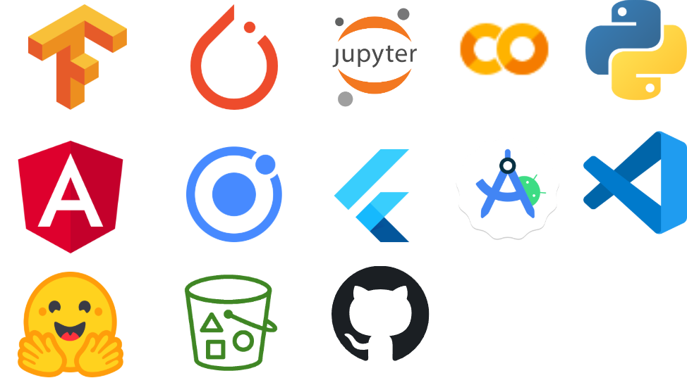

Logo de la app

# ButterflAI
TFM realizado por [Pablo García Muñoz]() y [Jairo Andrades Bueno]() en el **Master de Inteligencía Artificial y Big Data CPIFP Alan Turing**.

## Justificación del proyecto

Nostros dos siempre hemos querido hacer una aplicación de detección con uso a tiempo real para el TFM, inicialmente se nos ocurrio la idea de hacerlo sobre constelaciones ya que el resultado final podría quedar muy bien visualmente pero despues de probrar vimos que no era el enfoque perfecto para un TFM de este master, por ello seguimos con la idea de detección pero esta vez con **Mariposas** y así creamos **BUTTERFLAI** ya que es algo muy visual y comodo el poder usar una aplicación que ha tiempo real sea capaz de detectar la mariposa y te la classifique para decirte que tipo es.

## Índice

1. Descripción del proyecto
2. Obtención de datos
3. Limpieza de datos

    3.1 Eliminación de nulos
    3.2 Comprobación de los datos
    3.3 Descripción de los datos

4. Exploración y visualización de los datos
5. Preparación de los datos para los algoritmos de *Machine Learning*
6. Entrenamiento del modelo y comprobación del rendimiento
7. Uso de *NPL*
8. Web y Aplicación
9. Conclusiones

## Descripción del proyecto

**ButterlfAI** es una aplicación de detección y clasificación de mariposas a tiempo real con la capacidad de detectar hasta 100 clases de mariposas distintas, la hemos desarrollado en dos vertiente una en pagina web y otra para dispositivos moviles. Las dos hacen uso de un chatbot especializado en mariposas para en el caso de tener alguna duda poder preguntarle.

Estas son las tecnologías que hemos usado para desarrollar este proyecto:

### Diagrama del proyecto

Explicación detallada desde abajo hasta arriba:

* **Datos:**
    
    Los datos han sido recogidos desde kaggle ya que había varios dataset con un gran cantidad de fotos que es lo que necesitamos para los dos modelos.
    Estos tres dataset los juntamos en uno sumando las clases ya existente ya añadiendo las nuevas para poder subir el dataset bruto a S3 de AWS.

* **ButterflAI Modelo:**

    Para este TFM hemos usado dos modelos uno es de clasificación que está entrenado desde cero y otro de detección que ha sido creado haciendo *fine-tunning* al modelo de YOLOv8.

    * Clasificación: este modelo lo hemos hecho desde cero usando **TensorFlow** ya que lo usariamos en movil por lo que nos iba a hacer falta convertirlo a **.tflite** para que así este optimizado para moviles.

    * Detección: este modelo ha sido creado desde el modelo de YOLO v8 al cual le hemos hecho **fine-tunning** y así poder detectar las mariposas en las imagenes. YOLO está creado en **Pytorch** por lo que mas adelante está explicado que hemos hecho para usarlo en las dos aplicaciones.

* **Página web:**

    Para hacer uso de los dos modelos creamos una API en **HuggingFace Spaces** con un **Docker** y **FastAPI**, en esta API hay dos endpoints, una para cada modelo.
    La página web está hosteada en **Netlifly**.

* **Aplicación movil:**

    Usa los dos modelos exportados a **.tflite** para así poder optimizar la aplicación ya que usa la camara a tiempo real y no hubiese sido posible conseguir un buen resultado usando una API. La aplicación esta desarrollada en **Flutter**.

* **ChatBot:**

    Las dos aplicaciones tienen **ChatBot** el cual usa la API de **ChatGPT**.

